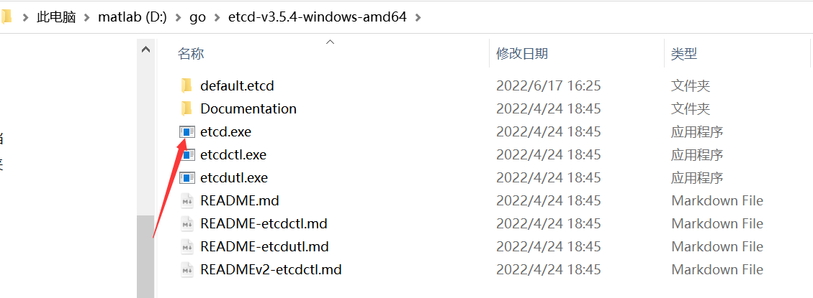
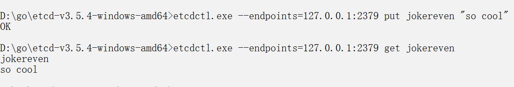
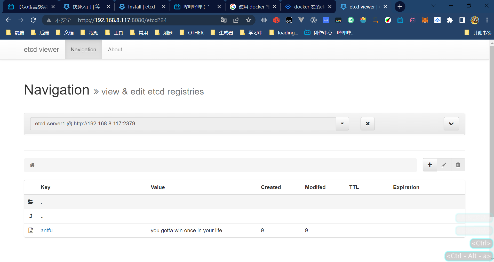

# etcd基本使用

Github项目地址: https://github.com/etcd-io/etcd/
官网: https://etcd.io/
下载地址: https://github.com/etcd-io/etcd/releases（这里下载自己对应的系统就好了）
etcd搭建及基本使用: [https://www.cnblogs.com/jiaojiner/p/14628866.html](https://www.cnblogs.com/jiaojiner/p/14628866.html)
go操作etcd: [https://www.liwenzhou.com/posts/Go/go_etcd/](https://www.liwenzhou.com/posts/Go/go_etcd/)

## 安装之后的具体情况


双击etcd.exe启动etcd

使用etcdctl.exe
这里老版本好像需要指定 ETCDCIL_API，默认好像是2

```shell
SET ETCDCIL_API = 3 // 之后才可以使用set命令
```


### etcd一般都是以集群的形式存在的一般为奇数（3,5,7,9(原因是应为leader挂掉之后, follow便于选举出新的leader)）

docker 安装etcd集群: [https://juejin.cn/post/7056638149534941214](https://juejin.cn/post/7056638149534941214)

#### 在虚拟机上跑了一下内存直接给我飙到97%2333（还是到服务器上好一些）

可视化界面效果（感觉有点不对劲2333）

