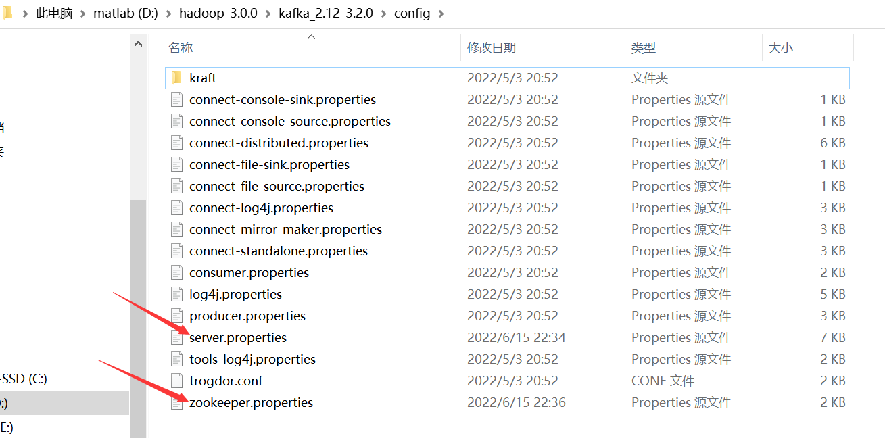
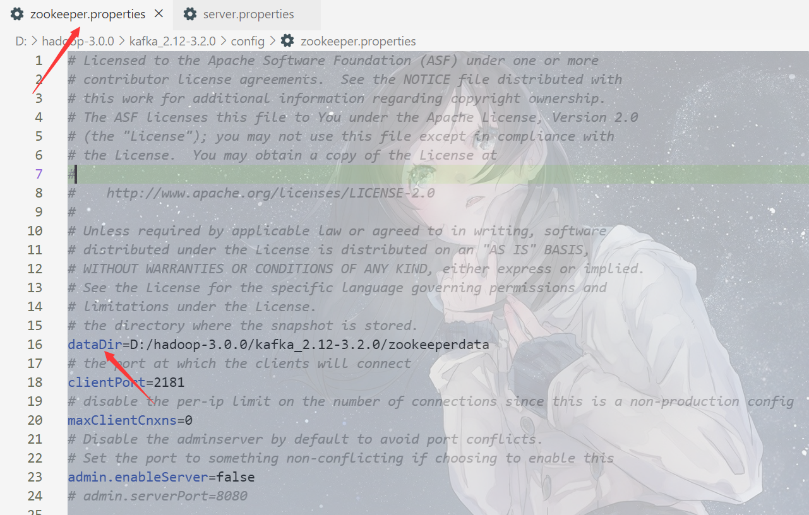
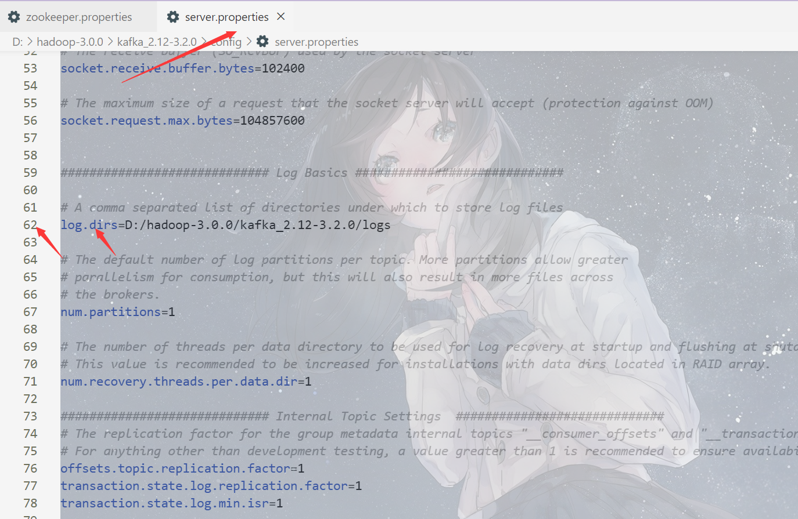

#  关于kafka的一些基本操作

## kafka 安装 与 使用 (windows平台)

之前学校在教hadoop的时候用docker跑过，[flume环境搭建docker版](https://blog.code520.com.cn/posts/38274.html)，Zookeeper及Kafka安装指南：https://docs.qq.com/doc/DTmdldEJJVGtTRkFi（kafka自带zookeeper）

kafka下载地址：https://kafka.apache.org/downloads

### 需要修改的文件



### 关于zookeeper的配置

dataDir：存放zookeeper数据的位置



#### 启动zookeeper

```shell
D:\hadoop-3.0.0\kafka_2.12-3.2.0>bin\windows\zookeeper-server-start.bat config\zookeeper.properties
```

### 关于kafka的配置

log.dirs：存放kafka日志的位置



#### 启动kafka

```shell
D:\hadoop-3.0.0\kafka_2.12-3.2.0>bin\windows\kafka-server-start.bat config\server.properties
```

#### 没次都要手动启动（挺麻烦的2333）
docker安装kafka和zookeeper: [https://juejin.cn/post/6844903829624848398](https://juejin.cn/post/6844903829624848398)

#### 创建一个消费者

```shell
D:\hadoop-3.0.0\kafka_2.12-3.2.0>bin\windows\kafka-console-consumer.bat --bootstrap-server 127.0.0.1:9092 --topic gnorev --from-beginning
```
